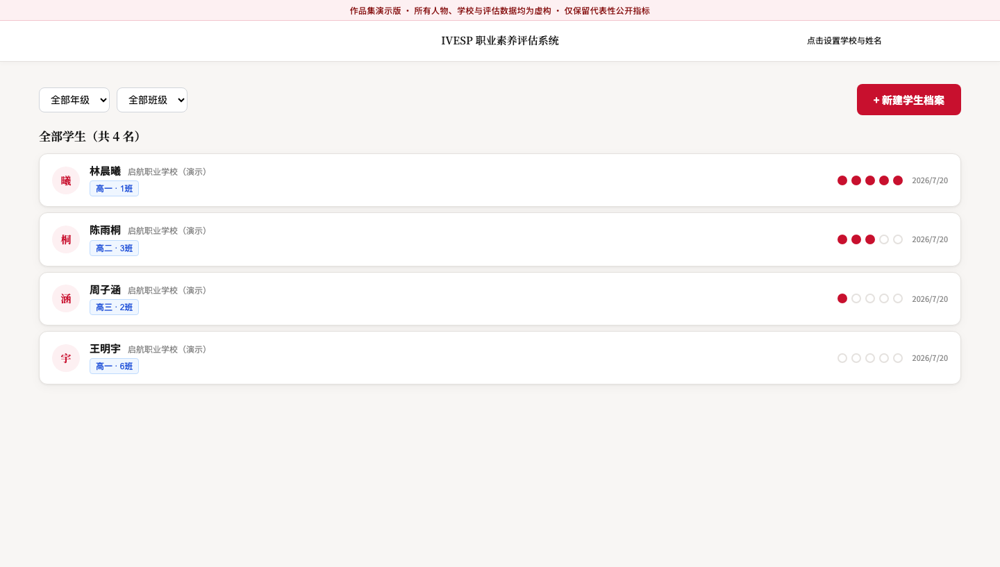
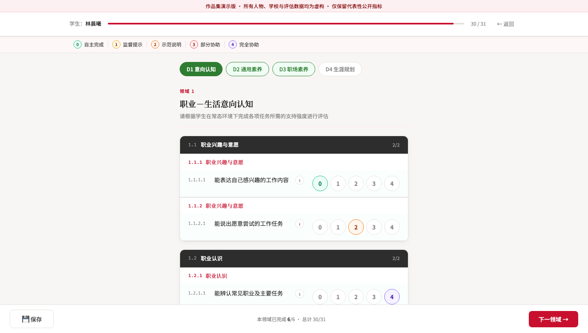
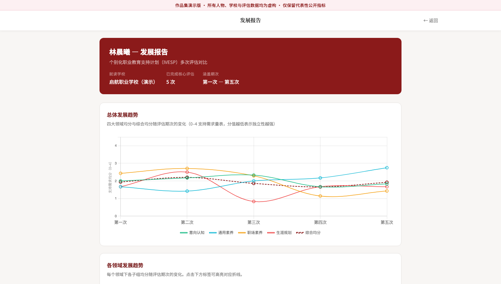

# 职业发展评估与成长档案系统

> 本仓库为项目脱敏展示版，不包含机构名称、学生数据、生产源码或内部资料。

## 在线体验

**[打开交互式 Demo](https://weisi-song.github.io/vocational-assessment-platform/)**

Demo 直接复用原系统的前端组件、页面结构、视觉样式和报告图表，后台数据替换为浏览器内的虚构学生档案。登录页已经填入演示账号，点击“登录”即可体验学生列表、五期评估档案、指标评分和成长对比报告。

为保护完整专业量表，公开版没有发布原系统的 100 多项正式指标及其说明，而是使用 31 项重新编写的代表性指标保留原评分流程与报告逻辑。学校、教师、学生、家庭和评估数据均为虚构内容。







## 项目背景

这个项目来自一项面向残障青年、尤其是心智障碍青年的职业发展计划。项目同时连接特教学校、企业、学生、家长、政策部门和研究机构，希望帮助青年在特教阶段更早认识自己的职业能力，并获得更有针对性的训练和就业支持。

项目采用一套成熟的个别化职业教育与转型支持方法。它把职业素养拆分为多个维度和 100 多项具体指标，教师需要定期评估学生，再根据结果调整培养计划，并在后续阶段为学生匹配更合适的实习和就业机会。

## 原来的工作方式

在数字化之前，教师每学期都要完成一轮包含 100 多项指标的评估，再手工计算各维度得分、制作图表并撰写报告。纸质材料和零散文件难以连续保存，同一名学生前后几次评估也很难放在一起比较。

真正的问题不只是“填表太慢”，而是专业方法没有被沉淀成一套连贯的工作流程：评估、报告、培养计划和学生成长记录彼此割裂，教师很难快速判断学生发生了什么变化，以及下一阶段应该重点训练什么。

## 我做的系统

- 把 100 多项指标整理成教师可以逐步完成的线上评分流程
- 自动计算各维度得分并生成可视化评估报告
- 为每位学生建立独立档案，集中保存基本信息和历次结果
- 支持对比学生在校期间通常完成的五轮评估
- 让教师能从变化趋势中识别优势、薄弱项和下一步培养重点
- 将原本分散的评分、报告和档案管理连成同一条工作流

## 系统如何运转

```text
建立学生档案
      ↓
教师按指标完成评估
      ↓
系统自动算分并生成图表
      ↓
形成当期评估报告
      ↓
沉淀到学生成长档案
      ↓
与前几轮结果对比，支持后续培养计划
```

## 从反馈中怎么改

第一版完成后，我面向一线教师进行讲解和试用，观察他们在哪些环节会犹豫、误解或需要返回修改。后续迭代主要围绕四件事展开：让评分顺序更符合教师习惯、让指标说明更容易理解、让报告在屏幕和打印场景中都更清楚，以及让教师能更快找到学生的历史记录和前后变化。

这里的用户反馈不是上线后的附加环节，而是产品形成过程的一部分。教师提供真实使用体验，项目负责人帮助补充专业背景并协调测试；我负责判断问题、调整方案并完成实现。

## 我的角色

这个系统由我主导完成从 0 到 1 的完整交付，包括需求梳理、产品框架、信息架构、交互设计、开发实现、测试、教师演示、意见收集、版本迭代、正式发布和用户培训。

专业评估方法和项目背景来自领域专家与项目团队；他们定义“应该评什么”，我负责把这套专业方法转化为一线教师真正能使用的数字产品。

## 带来的变化

教师不再需要为每名学生反复手工算分、制图和重写报告，学生的多轮评估也能在同一档案中连续保存和比较。更重要的是，评估结果从一份学期末材料变成了可以持续支持培养计划和就业准备的成长记录。

## 公开范围

公开仓库包含案例说明、脱敏 Demo 的编译产物和界面截图，不公开生产源代码。Demo 不连接生产数据库或真实身份系统；真实机构、学生档案、完整专业量表、指标说明和内部资料保持私有。

---

## English

# Vocational Assessment Platform

> This is a sanitized portfolio case study. Organization names, student data, production source code, and internal materials are excluded.

## Live demo

**[Open the interactive demo](https://weisi-song.github.io/vocational-assessment-platform/)**

The demo reuses the original system's frontend components, page structure, visual styling, and report charts while replacing backend data with fictional student records in the browser. The login screen is prefilled; select “登录” to explore student records, five assessment cycles, scoring, and longitudinal reports.

To protect the complete professional framework, the public build does not publish the original 100+ formal indicators or their guidance. It uses 31 newly written representative indicators to preserve the original scoring and reporting flow. All schools, teachers, students, families, and assessment data are fictional.


## Context

The system was built for a disability-youth career development program connecting special-education schools, employers, students, families, policy stakeholders, and research partners. It applies an established individualized vocational education and transition-support methodology with more than 100 indicators across multiple employability dimensions.

Teachers use the framework repeatedly during a student's time at school, then adapt training plans and later employment support around the results.

## Previous workflow

Each semester, teachers completed the full assessment, calculated dimensional scores, created charts, and wrote reports manually. Paper records and scattered files were difficult to carry forward, and comparing several assessment cycles for one student was especially cumbersome.

The deeper problem was fragmentation: assessment, reporting, training plans, and longitudinal records did not form one continuous workflow.

## What I built

- A guided online flow for 100+ assessment indicators
- Automatic dimensional scoring and visual report generation
- A dedicated record for each student
- Comparison across the five assessments typically completed during school
- A continuous workflow linking assessment, reporting, records, and future planning

## Workflow

```text
Create student record → Complete assessment → Calculate and visualize
                      → Generate report → Save to longitudinal record
                      → Compare cycles and plan future support
```

## Feedback and iteration

I walked frontline teachers through early versions and observed where the workflow caused hesitation, misunderstanding, or repeated corrections. Iterations focused on the order of assessment, clarity of indicator guidance, report readability on screen and in print, and faster access to historical comparisons.

Teachers contributed real usage feedback, while the program lead supplied domain context and coordinated testing. I translated that input into product decisions and implementation.

## My role

I led the complete zero-to-one delivery: requirements discovery, product structure, information architecture, interaction design, implementation, testing, teacher walkthroughs, feedback collection, iteration, release, and training.

Domain experts defined what should be assessed; I turned the methodology into a product teachers could actually use.

## Outcome

Teachers no longer needed to recalculate scores, rebuild charts, and recreate reports for every student. Multiple assessments became a continuous growth record that could support training and employment preparation over time.

## Public scope

This repository contains the case study, compiled artifacts for the sanitized demo, and interface screenshots; production source code is not published. The demo does not connect to the production database or identity system. Real organizations, student records, the complete professional framework, indicator guidance, and internal materials remain private.
